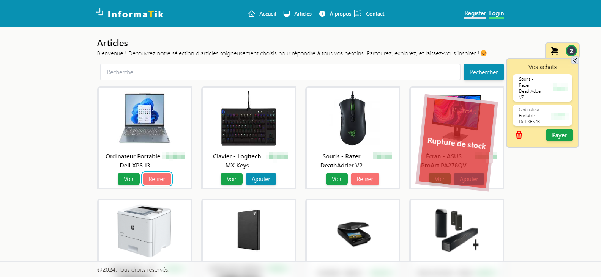

# E-Commerce PHP MVC by Rktoo



Bienvenue dans mon dépôt de **phpMvc2024** ! Ce projet est un exemple de mise en œuvre d'une application PHP, avec une structure simple pour le développement local.

## Table des matières

- [Description](#description)
- [Fonctionnalités](#fonctionnalités)
- [Installation](#installation)
- [Configuration](#configuration)
- [Utilisation](#utilisation)
- [Contribuer](#contribuer)
- [Licence](#licence)

## Description

Ce projet est une application PHP E-commerce conçue pour démontrer comment configurer et exécuter une application PHP en utilisant uniquement le serveur web intégré de PHP, sans avoir recours à des solutions comme XAMPP ou WAMP. Il est structuré pour être facile à déployer et à utiliser dans un environnement de développement.
Ceci constitue un moyen efficace pour s'initier au MVC.

## Fonctionnalités

- Serveur web intégré PHP pour le développement local
- Structure MVC (Modèle-Vue-Contrôleur)
- Connexion à une base de données SQLite
- Interface utilisateur simple et épurée
- Gestion des erreurs et des exceptions

## Installation

1. **Clonez le dépôt** :
   ```bash
   git clone https://github.com/Rktoo/phpMvC.git
   cd phpMvC
2. **Installer les dépendances nécessaires** :
    ```bash
    composer install
    npm install
## Configuration
1. **Créer un fichier .env à la racine du projet et renseignez le chemin de la base de donnée** :
    ```bach
    touch .env
2. **Dans le fichier .env insérez ces lignes** :
    ```bach
    PROJECT_NAME="phpMvc2024"
    DB_PATH="/data/database.db"
3. **N'oubliez pas d'activer votre driver Sqlite dans votre php.ini** :
    Ouvrez votre php.ini depuis votre dossier d'installation de PHP et décommenter les lignes extension=pdo_sqlite et extension=sqlite3
4. **Créer le dossier data à la racine. Le fichier database.db sera crée automatiquement après**

5. **Lancez le serveur dans le terminal avec la commande** :
    php -S localhost:8000

6. **Naviguer à l'URL : http://localhost:8000/seedmyproject/autorize/true pour créer le fichier database.db et faire le seed de la base de donnée.**

## Utilisation
1. **Vous aurez la possibilité de créer un compte et de le gérer**
2. **La création de compte n'est pas nécessaire pour la navigation, sauf si vous envisagez de payer vos articles**
3. **Vous aurez aussi la possibilité de gérer votre compte dans votre espace client**
## Contribuer
1. **Forkez le dépôt.**
2. **Créez une branche pour vos modifications** :
#### git checkout -b ma-nouvelle-fonctionnalité
3. **Faites vos modifications et commitez-les et poussez les sur votre fork**
4. **Ouvrez une Pull Request sur GitHut.**

## Crédits
### Icônes :
- **vectorsmarket15**
- **smashingstocks**
### Images : 
- **Images sous droits d'auteur** : Les images utilisées dans ce projet sont protégées par des droits d'auteur. Merci de ne pas les réutiliser sans autorisation.

## LICENCE
1. **Ce projet est sous la licent MIT.**

# Merci pour votre visite et bonne utilisation ! 

